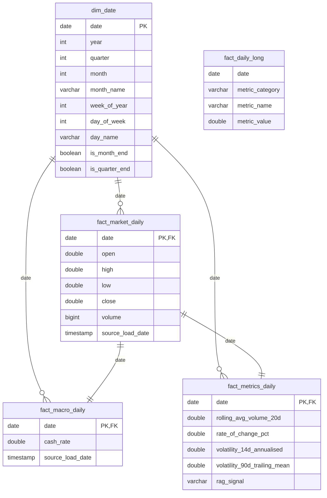

# Mart (Curated) Data Model — Proposal

Status: **proposal, not yet implemented** — for review before `align.py` / `metrics.py` are built against it.

## Why this needs a decision before implementing

`docs/prompt_data_curation_and_dashboard.md` requires two specific wide tables — `curated.aligned_daily` and `curated.metrics_daily` — read directly by `app.py`. Built literally, that's a single wide table per step: fine for *this* dashboard, but every new chart or custom dashboard downstream would mean either widening those tables further or writing a bespoke query each time. "Flexible enough for users to build custom dashboards" argues for a small star schema underneath those two required tables, not instead of them — the literal deliverables stay, a normalized layer sits behind them as the actual source of truth, and one long/tidy table sits alongside them for generic ad-hoc charting.

## Proposed shape

### Layer 1 — normalized facts (source of truth)

Built by `align.py` (market + macro facts) and `metrics.py` (metrics fact), from `silver.*`, one row per trading date per table:

- **`curated.dim_date`** — one row per ASX200 trading date present in the data (not a full continuous calendar — this platform tracks one market, no need for a general-purpose date spine). Calendar attributes for slicing: year/quarter/month/week/day-of-week, month-end/quarter-end flags.
- **`curated.fact_market_daily`** — `date, open, high, low, close, volume, source_load_date` (lineage back to `silver.asx200_daily.load_date`).
- **`curated.fact_macro_daily`** — `date, cash_rate, source_load_date` — kept separate from market facts so a second macro series could be added later without touching this table's grain or the market fact table at all.
- **`curated.fact_metrics_daily`** — `date, rolling_avg_volume_20d, rate_of_change_pct, volatility_14d_annualised, volatility_90d_trailing_mean, rag_signal` — derived values kept in their own fact table, separate from raw market/macro facts, since they're a different kind of thing (computed, re-derivable) and someone should be able to recompute metrics without touching ingestion.

### Layer 2 — the required wide tables (still built, literally, as tables)

- **`curated.aligned_daily`** = `fact_market_daily` left-joined to `fact_macro_daily` on `date`. Still a physically written table (not a view) — `docs/prompt_data_curation_and_dashboard.md` says `align.py` must "write to DuckDB table curated.aligned_daily", so it stays a real table, just built by joining the two fact tables rather than being the only artifact `align.py` produces.
- **`curated.metrics_daily`** = `aligned_daily` left-joined to `fact_metrics_daily` on `date`. Same reasoning — `app.py` reads only this table, unchanged from the original spec.

### Layer 3 — the flexible layer

- **`curated.fact_daily_long`** — every numeric measure from the three fact tables, unpivoted into `(date, metric_category, metric_name, metric_value)`. This is the actual answer to "flexible enough for custom dashboards": a new chart just filters `WHERE metric_name = 'rate_of_change_pct'` — no schema change, no knowledge of which wide table a value lives in, and adding a future metric is an `INSERT`, not an `ALTER TABLE`. `metric_category` (`market` / `macro` / `derived`) lets a dashboard builder group a metric picker sensibly.

## What this changes vs. the current build-spec wording

- `align.py` now writes 3 tables instead of 1: `fact_market_daily`, `fact_macro_daily`, `aligned_daily` (the last one unchanged in name/shape from the original spec).
- `metrics.py` now writes 3 tables instead of 1: `fact_metrics_daily`, `metrics_daily` (unchanged in name/shape), and `fact_daily_long`.
- `dim_date` is new — small, built once, no source dependency beyond the date range already in `fact_market_daily`.
- Nothing about `app.py`'s contract changes — it still reads only `curated.metrics_daily`, unchanged.

## Open question for you

Should `fact_daily_long` be built by `metrics.py` (since it needs the final joined values from all three fact tables), or as its own small module (e.g. `mart_long.py`) run after `metrics.py`? Leaning toward the latter — keeps `metrics.py` focused on computing metrics, not also owning the flexible-layer pivot — but flagging it as a call worth making explicitly rather than silently.
